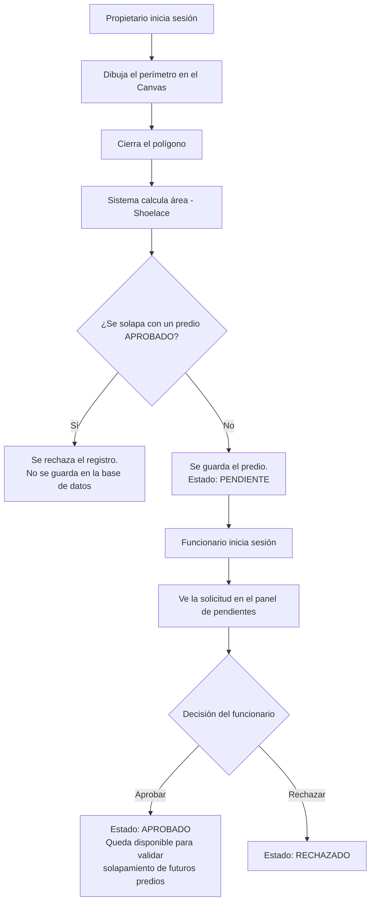

# Flujo de Aprobación de Predios — SIGCAT

Documentado por: José Sánchez (QA)

## Descripción general

El registro de un predio nunca queda oficial de forma automática. Todo predio nuevo pasa obligatoriamente por una validación geométrica automática y luego por una revisión humana antes de considerarse parte del catastro.

## Diagrama de flujo

## Estados posibles de un predio

| Estado | Significado | ¿Quién lo asigna? |
|--------|-------------|---------------------|
| PENDIENTE | El predio pasó la validación geométrica automática, pero aún no ha sido revisado por un humano | Sistema, automáticamente al guardar |
| APROBADO | Un funcionario confirmó la solicitud. A partir de este momento, el predio se usa como referencia para detectar solapamientos en futuros registros | Funcionario catastral |
| RECHAZADO | Un funcionario rechazó la solicitud | Funcionario catastral |

## Reglas de negocio clave

1. **La medición del propietario nunca es la fuente de verdad final.** Solo pasa a ser oficial cuando un funcionario la aprueba.
2. **Un predio en estado PENDIENTE no afecta la validación de solapamiento.** Solo los predios APROBADO se comparan contra nuevos registros — esto evita que dos solicitudes pendientes y en conflicto entre sí bloqueen indefinidamente el sistema.
3. **La detección de solapamiento ocurre ANTES de guardar**, no después. Si hay conflicto, el predio ni siquiera llega a existir en la base de datos como PENDIENTE.
4. **Toda aprobación o rechazo queda vinculado al funcionario** que tomó la decisión (trazabilidad).